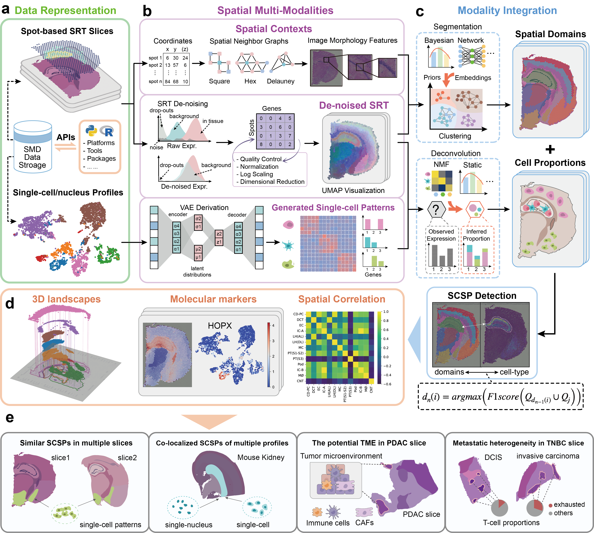

# Despot

Spot-based spatial resolved transcriptomic (SRT) technologies facilitate the elucidation of cellular function by preserving invaluable spatial contexts.Currently, associating cell-types of single-cell profiles with spatial domains in SRT remains a challenge. Here, we propose a novel multi-modality integration approach called Despot to detect spatial domains correlating to single-cell profiles (SCSPs). Despot synthesizes segmentation and deconvolution using the deep-learning model to associate cell-types with appropriate domains. We demonstrate the advantages of Despot insensitivity and effectiveness. Additionally, we discover the co-localization between fibroblasts and immune-related  cells that indicate potential tumor microenvironment (TME) domains in  the given slices obscured by previous SCSP detection approaches. We further elucidate the identified domains and find that *Srgn* may be an important TME marker in SRT slices. By deciphering SCSPs of T cells in breast cancer tissue, we demonstrate  that the proportions of exhausted T cells are significantly larger in  invasive carcinoma than in ductal carcinoma.

