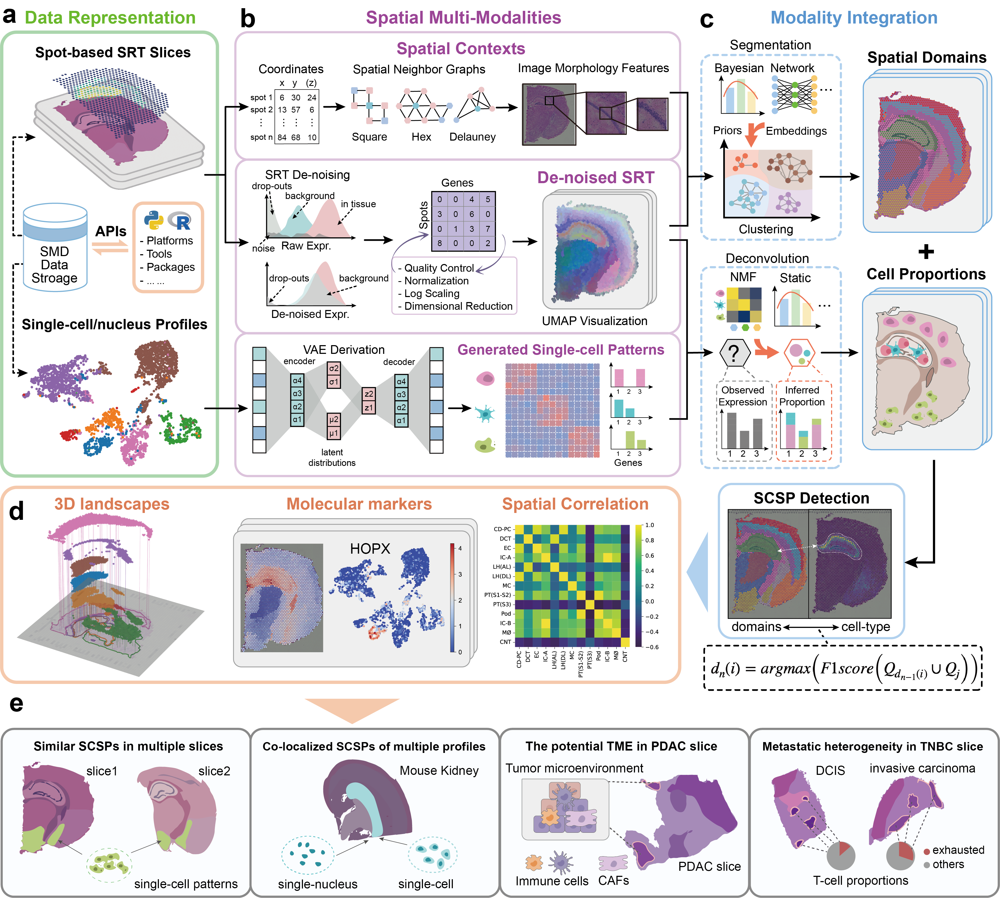
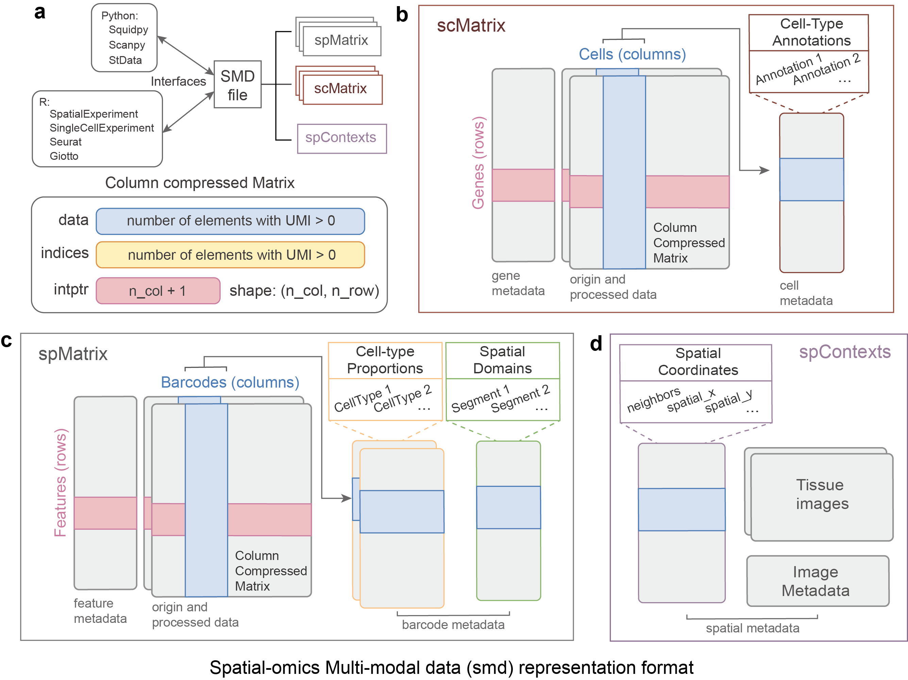

# Despot

Spot-based spatial resolved transcriptomic (SRT) technologies facilitate the elucidation of cellular function by preserving invaluable spatial contexts.Currently, associating cell-types of single-cell profiles with spatial domains in SRT remains a challenge. Here, we propose a novel multi-modality integration approach called Despot to detect spatial domains correlating to single-cell profiles (SCSPs). Despot synthesizes segmentation and deconvolution using the deep-learning model to associate cell-types with appropriate domains. We demonstrate the advantages of Despot insensitivity and effectiveness. Additionally, we discover the co-localization between fibroblasts and immune-related  cells that indicate potential tumor microenvironment (TME) domains in  the given slices obscured by previous SCSP detection approaches. We further elucidate the identified domains and find that *Srgn* may be an important TME marker in SRT slices. By deciphering SCSPs of T cells in breast cancer tissue, we demonstrate  that the proportions of exhausted T cells are significantly larger in  invasive carcinoma than in ductal carcinoma.



## Installation

Despot is implemented by Python 3.9.7 and R 4.1.3 in Ubuntu 20.04. 

**For Python 3.9.7:**

First we create a new virtual environment, and activate it. Then we install the basic python packages in `requirements.txt`

```shell
conda create --name Despot python=3.9
conda activate Despot
pip install -r requirements.txt
```

**For R 4.1.3:**

Run this code in R Console for Despot basic requirements

```R
install.packages(c("BiocManager", "Matrix","stringr"))
BiocManager::install(c("rhdf5", "png", "rjson","data.table","SingleCellExperiment"))
```

## Usage

We run the `main.py` to execute the configures in `/configs` using python:

```shell
python main.py
```

The required softwares will be installed automatically. Users also can install them manually using the URLs in `source.md `.  The smdFiles generated are stored in `h5ads`.

**Config Settings**

In default, we run the configures in `/configs`. Users can set their own configs with the guidance below:

```json
{
  "dataPath": "path/to/your/SRT data/input",
  "imgPath": "path/to/your/image/input under dataPath",
  "platform": "10X_Visium",  /*10X_Visium, ST, Slide-seq*/	
  "dataSpices": "Human",	/*Human, Mice*/
  "name": "your_sample_name",
  "filter_matrix": true,  /*Whether the matrix is filtered*/
  "smdFile": "path/to/output/smdFiles",
  "ground_truth": "metadata.csv", /*SRT ground truth file*/
  "ground_name": "ground_truth", /*SRT ground truth name*/
  "scDataPath": "path/to/your/single-cell data/input",
  "scType": "Any", /*Any, tsv, mtx, txt, h5ad*/
  "scBarcodes": "count_matrix_barcodes.tsv",
  "scFeatures": "count_matrix_genes.tsv",
  "scMatrix": "count_matrix_sparse.mtx",
  "scGroundTruth": "metadata.csv",
  "scGroundName": "celltype_minor",
  "load_hires": true,
  "load_fullres": false,
  "fullres_path": "path/to/your/fullres_datapath",
  "Decontamination": ["none","SPCS","SpotClean", "SPROD"...],
  "Clustering": ["BayesSpace", "SpaGCN", "leiden", "stlearn", "SEDR"...],
  "Deconvolution": ["CARD","Cell2Location","SPOTlight", "spacexr","StereoScope"...],
}
```

Despot will load these configs first, check for the environments, and run for outputs in smdFiles.

## Description

### Data Respresentation

Despot designs a spatial multi-omics data representation format called *smd* based on HDF5 binary data. A *smd* file has interfaces with Python and R infrastructures, containing *spContexts* and a series of *scMatrixs* and *spMatrixs*, whose core matrices are column compressed. 



### 


